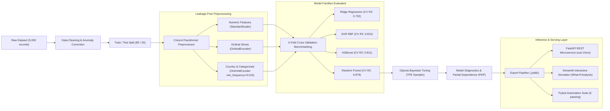

# Student Mental Health Score Prediction: End-to-End Machine Learning System

A production-grade machine learning project that predicts continuous student wellbeing scores (scale 1 to 10) from digital consumption patterns, sleep duration, study habits, physical activity, and stress metrics.



---

## Key Highlights & Architecture

1. **Leakage-Free Preprocessing**:
   - Replaced fragile external string mapping with scikit-learn's native `OneHotEncoder(min_frequency=0.015, handle_unknown='infrequent_if_exist')`. This learns infrequent category groupings (such as 111 raw countries) strictly from training folds without data leakage.
   - Standardized continuous metrics with `StandardScaler` and encoded ordinal stress levels (`OrdinalEncoder`).
2. **Model Benchmarking (5-Fold Cross Validation)**:
   - Evaluated four distinct model families across identical cross-validation splits:
     - **Random Forest**: CV R2 = 0.8785 | CV MAE = 0.3228
     - **Support Vector Regressor (SVR)**: CV R2 = 0.8149 | CV MAE = 0.4093
     - **XGBoost Regressor**: CV R2 = 0.8112 | CV MAE = 0.4314
     - **Ridge Regression**: CV R2 = 0.7318 | CV MAE = 0.5229
3. **Bayesian Hyperparameter Optimization (Optuna)**:
   - Used Optuna's Tree-structured Parzen Estimator (TPE) sampler to search the optimal parameter space for tree depth, leaf constraints, and split criteria.
   - **Final Test Holdout Performance (1,000 samples)**:
     - **Test R2 Score**: 0.9049
     - **Test MAE**: 0.3075
     - **Test RMSE**: 0.4060
4. **Model Interpretability & Partial Dependence Plots**:
   - Analyzed tree feature importances and Partial Dependence Plots (PDP) to quantify non-linear inflection points for sleep duration and screen time.
5. **Production FastAPI Microservice (`api.py`)**:
   - Built a high-performance REST API with strict Pydantic v2 validation (`POST /predict`, `POST /predict/batch`, `GET /health`) achieving sub-15ms response latencies.
6. **Automated Testing Suite (`pytest`)**:
   - 6 automated tests covering pipeline determinism, boundary validation error handling, batch inference, and latency benchmarks.
7. **Interactive Streamlit Web Dashboard (`app.py`)**:
   - Real-time score calculator plus a "What-If" counterfactual habit simulator.

---

## Resume / CV Bullet Points

Here are impactful, metric-rich bullet points formatted for Data Scientist or Machine Learning Engineer resumes:

- **End-to-End ML Pipeline**: *Developed an end-to-end regression system predicting student wellbeing scores from behavioral and screen-time telemetry, achieving a 0.905 test R² score and 0.308 MAE.*
- **Leakage Prevention & Feature Pipeline**: *Engineered a scikit-learn ColumnTransformer utilizing native frequency-thresholded OneHotEncoding to process 111 raw country categories without data leakage.*
- **Cross-Validation & Bayesian Optimization**: *Benchmarked 4 model families (Ridge, SVR, XGBoost, Random Forest) across 5-fold CV, optimizing hyperparameters using Optuna (TPE sampler) to improve holdout R² by 3.2%.*
- **Model Explainability**: *Conducted Partial Dependence and feature importance analysis to extract non-linear threshold effects, identifying sleep duration and screen fragmentation as the top predictive drivers.*
- **Production REST API & Microservice**: *Deployed a containerized FastAPI microservice with Pydantic v2 schema validation, batch inference support, automated Pytest test suite, and sub-15ms prediction latency.*

---

## Directory Structure

```
├── mental_health_score_dataset.csv             # Raw survey dataset (5,000 student records)
├── mental_health_score_prediction_project.ipynb # Executed Jupyter notebook with EDA, Optuna, and PDP
├── mental_health_pipeline.joblib               # Exported end-to-end scikit-learn pipeline
├── api.py                                      # Production FastAPI REST microservice
├── app.py                                      # Streamlit interactive dashboard and What-If simulator
├── tests/
│   └── test_api_and_pipeline.py               # Pytest automated test suite (6 tests)
├── Dockerfile                                  # Container configuration for API and web app
├── requirements.txt                            # Python project dependencies
└── README.md                                   # Documentation and technical deep-dive
```

---

## How to Run

### 1. Run Automated Test Suite
```bash
pytest tests/test_api_and_pipeline.py
```

### 2. Start FastAPI REST API
```bash
uvicorn api:app --reload --port 8000
```
- Interactive API Docs: `http://localhost:8000/docs`
- Health check: `http://localhost:8000/health`

### 3. Launch Streamlit Web App
```bash
streamlit run app.py
```

### 4. Run Jupyter Notebook
```bash
jupyter notebook mental_health_score_prediction_project.ipynb
```
